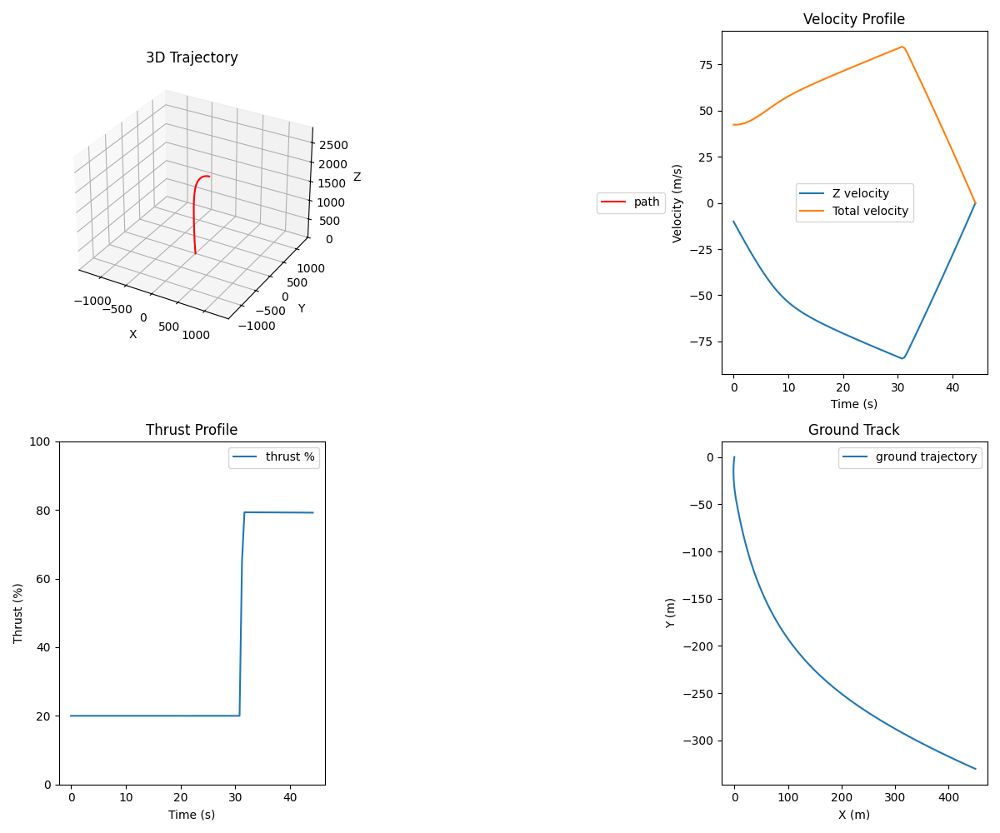

# G-FOLD: Fuel Optimal Large Divert Guidance Algorithm

This project implements the G-FOLD algorithm for spacecraft landing trajectory optimization based on:
- [Blackmore et al. "Minimum-Landing-Error Powered-Descent Guidance for Mars Landing Using Convex Optimization"](http://larsblackmore.com/iee_tcst13.pdf)
- [Neal et al. "Fuel-Optimal Spacecraft Guidance for Landing in Planetary Pits"](https://www.ri.cmu.edu/pub_files/2016/4/Fuel-Optimal-Spacecraft-Guidance-for-Landing-in-Planetary-Pits-Neal-Bhasin.pdf)

G-FOLD is a convex-optimization algorithm that generates the fuel-optimal path to land a spacecraft at the desired location.



## Project Structure

This repository is organized into language-specific implementations:

- `generator/` - Python package that implements G-FOLD and generates C/C++ code using CVXPYGen
- Additional language implementations will be added in the future

## Getting Started

Choose the implementation that best fits your needs:

- For Python usage or code generation, see [Generator README](generator/README.md)

## Platform Support
By default, all tools work on Windows, macOS and Linux. However, c++ code generation feature will not support windows, but the bindings that use the generated code will run on windows too.

## Development

To set up the development environment:

```bash
git clone https://github.com/samutoljamo/g-fold.git
cd g-fold
```

Then follow the instructions in the specific package directory you want to work with.
