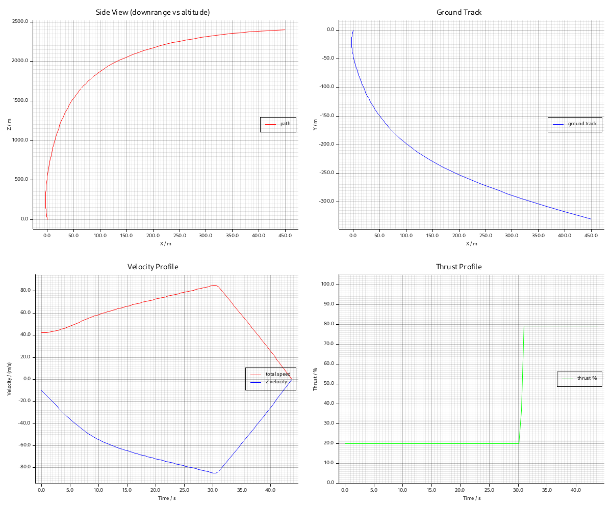

# G-FOLD: Fuel Optimal Large Divert Guidance Algorithm

This project implements the G-FOLD algorithm for spacecraft landing trajectory optimization based on:
- [Blackmore et al. "Minimum-Landing-Error Powered-Descent Guidance for Mars Landing Using Convex Optimization"](http://larsblackmore.com/iee_tcst13.pdf)
- [Neal et al. "Fuel-Optimal Spacecraft Guidance for Landing in Planetary Pits"](https://www.ri.cmu.edu/pub_files/2016/4/Fuel-Optimal-Spacecraft-Guidance-for-Landing-in-Planetary-Pits-Neal-Bhasin.pdf)

G-FOLD is a convex-optimization algorithm that generates the fuel-optimal path to land a spacecraft at the desired location.



## Project Structure

This repository is organized into language-specific implementations:

- `generator/` - Python package that implements G-FOLD and generates C/C++ code using CVXPYGen
- `rust/gfold-core/` - Rust implementation solving the SOCP directly with Clarabel ([README](rust/gfold-core/README.md))

## Getting Started

Choose the implementation that best fits your needs:

- For Python usage or code generation, see [Generator README](generator/README.md)
- For the Rust solver, see [gfold-core README](rust/gfold-core/README.md)

## Platform Support
By default, all tools work on Windows, macOS and Linux. However, c++ code generation feature will not support windows, but the bindings that use the generated code will run on windows too.

## Development

To set up the development environment:

```bash
git clone https://github.com/samutoljamo/g-fold.git
cd g-fold
```

Then follow the instructions in the specific package directory you want to work with.

## The direction of this project
I originally did this project during high school out of pure curiosity. For the longest time, I wanted to make this better, but I did not find the time to do it. The mathematics are not trivial nor is the stack simple. It was based on cvxpy with the Clarabel as the backend and cvxpygen for generating the c++ code. To solve both issues, this is now mostly "vibe-coded". The python dependency + c++ generator was replaced with a rust based core that uses Clarabel directly. This has lots of benefits as the even though the solver and the problem is the same, AI was actually able to generate a simpler problem for Clarabel than what cvxpy originally created. This makes sense as cvxpy is the general tool, but our problem is very specific. What we also get for free is that now doing bindings for other languages is much more simpler. The drawback of this approach is that the modelling is now much more harder to understand than it was using the nice modelling language that cvxpy provides, but with AI ergonomics are a non-issue as long as it does not get so complicated that AI would have trouble *and* we can ensure correctness. This is done keeping the cvxpy implementation as a reference implementation: there are automated tests that make sure using various cases that both the rust-core and cvxpy implementation yield the same results within a defined tolerance. The implementation ended being quite fast even without fixing the problem / allowing subsequent solves to only update parameters. It's definitely much faster than the python implementation, but of course, the cvxpygen generated c++ and rust implementation will not have major difference as most of the job is done by Clarabel in both implementations. Although, as mentioned before, the simpler problem definition helps for larger `n` values. I hope you like this :)
